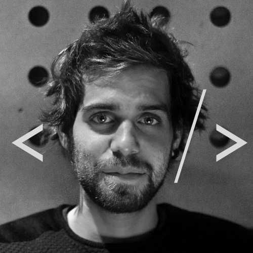

<!DOCTYPE html>
<html lang="en"><head>
    <meta charset="UTF-8">
    <meta name="viewport" content="width=device-width, initial-scale=1.0">
    <title>CV_Yvan-Goudmany</title>
    <link rel="stylesheet" href="./assets/scss/style.css">
    <link rel="stylesheet" href="https://cdnjs.cloudflare.com/ajax/libs/font-awesome/5.14.0/css/all.min.css">
    <link href="https://fonts.googleapis.com/css2?family=Poiret+One&amp;family=Roboto&amp;display=swap" rel="stylesheet">
</head>
<page>
<body cz-shortcut-listen="true"><page>
    <aside>
        

            

                
            

            

                <h1>Yvan Goudmant</h1>
                

            

        

    </aside>
    <article>
        

            

                

                    
<h1>Contact</h1>

                    
<i class="fas fa-phone-alt"></i>

                    
<a id="link" href="tel:+32497 297 667">0497/29 76 67</a>

                    
<i class="fas fa-map-marker-alt"></i>

                    
Chemin du saint désert 9  5100 Wépion

                    
<i class="far fa-envelope"></i>

                    
<a id="link" href="mailto:yvangoudmant@gmail.com">yvangoudmant@gmail.com</a>

                    
<i class="fab fa-github"></i>

                    
<a id="link" href="https://github.com/yvangoudmant/">GitHub</a>

                

                

                    
<h1>Langages acquis</h1>
                        

                            <i class="fas fa-code"></i>
                            <i class="fab fa-html5"></i>
                            <i class="fab fa-css3-alt"></i>
                            <i class="fab fa-bootstrap"></i>
                            <i class="fab fa-js"></i>
                            <i class="fab fa-wordpress-simple"></i>
                            <i class="fab fa-php"></i>    
                        
 
                    

                     
                    
<h1>Outils aquis</h1>
                        

                            <i class="fab fa-docker"></i>
                            <i class="fab fa-figma"></i>
                            <i class="fab fa-invision"></i>
                            <i class="fab fa-git"></i>
                            <i class="fab fa-github"></i>
                            <i class="fab fa-gitkraken"></i>
                        

                    

                

            

            

                

                    <h1>Hello world!</h1>
                    
Par mes diverses expériences professionnelles, j'ai eu l’occasion d'acquérir des qualités comme le sens commercial, l'écoute, la patience. J'ai également des compétences avec des logiciels et applications de gestion et de création.

                        Suite à ma formation chez Becode en tant que Web développeur junior, je suis à la recherche d'un stage en entreprise. J'ai eu l'occasion de me spécialiser dans l'UX et les langages Web Dev tel que le HTML et le CSS, la formation ma aussi permise d'acquérir des compétences comme l'autogestion et l'apprentissage continue, la gestion des produits afin d'apporter un meilleur suivi, et répondre au mieux aux différentes attentes des clients.
                        Enthousiaste, rigoureux, tourné vers l’avenir j'ai l'habitude de travailler en équipe, je pense pouvoir être un réel atout. 

                

                

                    
<h1>Expérience professionnelle</h1>

                    
2014-2020

                    
<b>Sales Advisor Switch</b> 
(Namur, Erpent, Louvain la neuve, Nivelles, Arlon)

                        <ul>
                            <li>Audit et conseil clients</li>
                            <li>Maitrise des fonctionnalités de la gamme produit</li>
                            <li>Esprit d'équipe</li>
                        </ul>
                    

                    
2013

                    
<b> Sales Assistant - Desigual/Pull&Bear </b> 
(Bruxelles, Louvain la neuve Esplanade)

                        <ul>
                            <li>conseil clients</li>
                        </ul>
                    

                    
2012

                    
<b>Photographes/ Laborantin Close-Ups</b> 
(Knokke)

                        <ul>
                            <li>Respect des objectifs commerciaux</li>
                            <li>Flexibilité horaire</li>
                            <li>Développement du portefeuille client en autonomie</li>
                        </ul>
                    

                    
2009-2011

                    
<b>Graphiste, Web Designer (Création d’une newsletter) Galerie d’Art Dérapage</b> 
(Bruxelles)

                        <ul>
                            <li>Réactivité et adaptabilité </li>
                            <li>Excellente compétence relationnelle</li>
                            <li>Planification et conception de supports graphiques</li>
                        </ul>
                    

                

                

                    
<h1>Formation</h1>

                    
2020-2021

                    
<i class="fas fa-map-marker-alt"></i> Becode

                    
Junior Web Developer

                    
2009-2011

                    
<i class="fas fa-map-marker-alt"></i>Le 75

                    
Écoles supérieure des Arts et de l’image, (Option Graphisme) Bruxelles.
                    

                    
2003-2009

                    
<i class="fas fa-map-marker-alt"></i>Ma campagne

                    
Diplômé en Professionnel-Option artistique (infographie section publicité) 

                

            

        

    </article> 
</body>
</page>
</html>